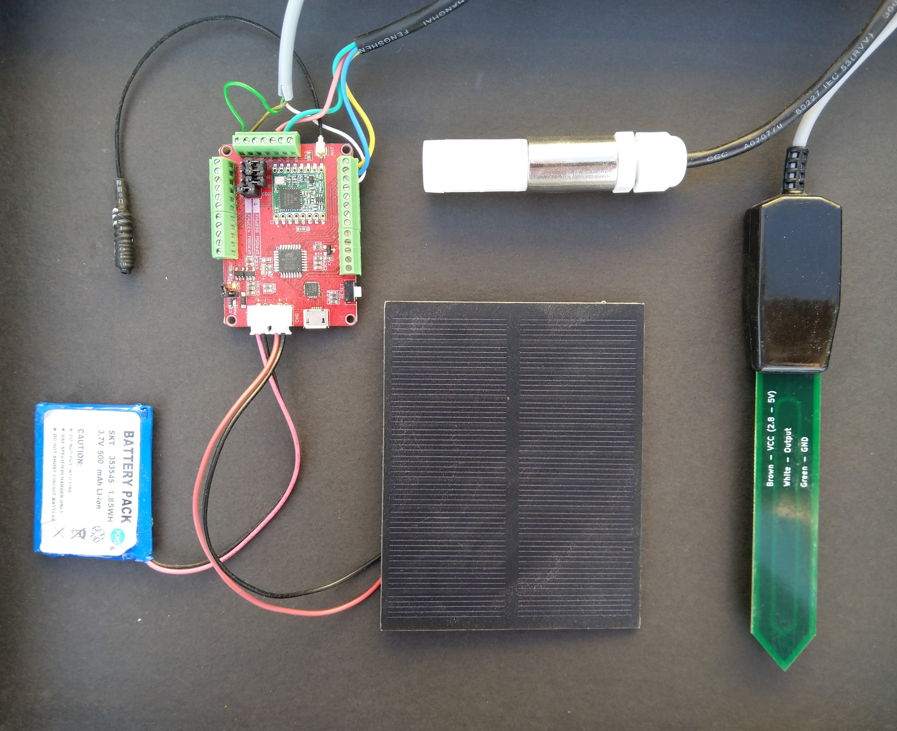
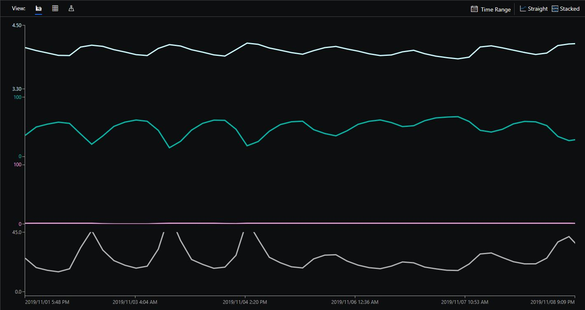

# FieldGateway.LoRa.MaduinoAirTemperatureHumiditySoilMoistureSensorNode
This sample MakerFabs Maduinio client for my [LoRa](https://lora-alliance.org/) field gateway projects will run indefinitely as long as the battery/solar panel are suitably sized, the solar panel is kept clean and the device isn't shaded.

Solar Powered MakerFabs Maduinio with air temperature, humidity and soil moisture sensors client for my Windows 10 IoT Core LoRa field gateways. The device is a bit dusty as I have been running it on the Window sill for six months to test battery & solar panel sizing. T

My Maduino client uses
* [MakerFabs Maduino LoRa Redio 868MHz](https://makerfabs.com/index.php?route=product/product&product_id=438)
* [DF Robot SHT20 Temperature & Humidity sensor]( https://www.dfrobot.com/wiki/index.php/SHT20_I2C_Temperature_%26_Humidity_Sensor_(Waterproof_Probe)_SKU:_SEN0227)
* [Pino tech SoilWatch 10 soil moisture sensor ](https://pino-tech.eu/product/soilwatch-10/)
* [Elecrow 1W Solar Panel with Wires](https://www.elecrow.com/1w-solar-panel-with-wires-p-817.html)
* 500mAh Battery

MakerFabs Maduino

Azure Iot Central Visualisation

There is also a [Maduino 433MHz](https://makerfabs.com/index.php?route=product/product&product_id=439)

